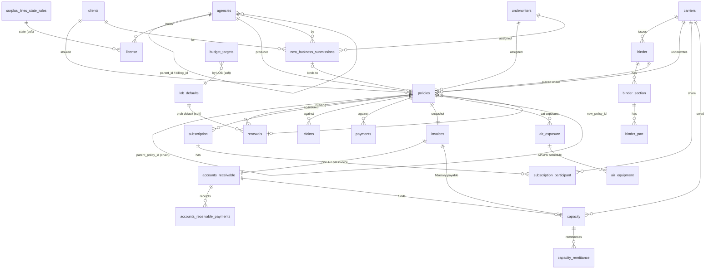
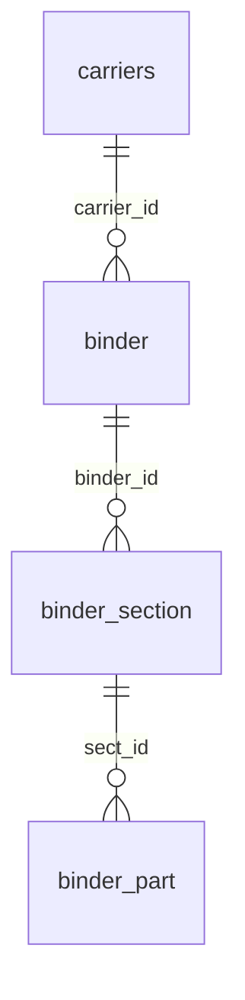
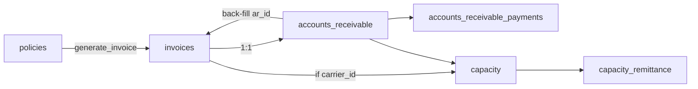
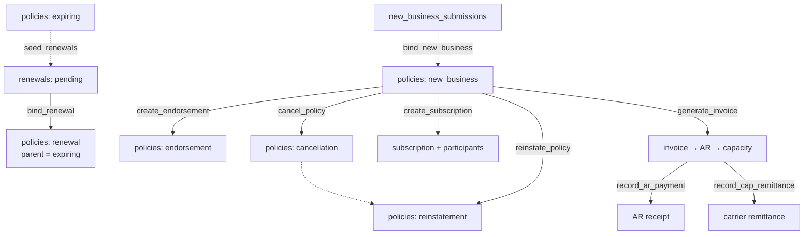

# Database & Backend Logic

Reference documentation for the Evertas MGA platform's Postgres/Supabase schema:
tables, associations, generated columns, triggers, computed views, the
lifecycle functions that drive the policy workflow, and the reporting/export
projections.

This is a **Managing General Agent (MGA)** back office. It ports the
"SingleSource MGA" spreadsheet workbook into a relational model. The central
object is a **policy transaction**; almost everything else either feeds a
policy (submissions, renewals, binders), hangs off it (claims, invoices,
receivables, carrier payables), or reports on it (QBO exports, Lloyd's
bordereaux, aging).

- **Platform:** Supabase (Postgres 17), migrations in `supabase/migrations/`.
- **Access:** single-tenant internal tool. The browser uses the `authenticated`
  role; RLS policies are permissive (`using (true)`). Multi-table writes go
  through `security definer` functions.
- **Related docs:** [TABLE_IMPLEMENTATION_NOTES.md](TABLE_IMPLEMENTATION_NOTES.md)
  (per-table deviations), [DB_TESTING_PLAN.md](DB_TESTING_PLAN.md),
  [SUPABASE_QUICKSTART.md](SUPABASE_QUICKSTART.md).

---

## 1. Conventions (apply to almost every table)

| Convention | Detail |
|---|---|
| **Surrogate PK** | `id bigint generated always as identity`. FKs are `bigint`. Two tables use a **natural key** instead: `surplus_lines_state_rules` (`state`) and `lob_defaults` (`line_of_business`). |
| **Human-readable ref** | Each entity has a stored generated `*_ref` like `POL-2026-0001` — `PREFIX-<ref_year>-<zero-padded id>`. `ref_year` is stamped at insert; `id` is padded globally (not per-year) so the ref is immutable. |
| **Audit timestamps** | `created_at timestamptz default now()`. Tables that can change also have `updated_at`, maintained by a trigger (Postgres has no `ON UPDATE`). |
| **`updated_at` trigger** | Shared `public.set_updated_at()` (defined in the agencies migration, reused everywhere). Fires `before update … for each row`. |
| **Same-row math → stored generated columns** | e.g. `policies.accounting_date`, `payments.balance`, `capacity.gross_commission_amt`, `air_exposure.tiv`. |
| **Cross-row / cross-table / date-dependent math → views** | Anything depending on `current_date`, an aggregate, or another table cannot be a stored generated column, so it lives in a `security_invoker` **`*_computed` view**. |
| **RLS** | Enabled on every table. Base tables get a permissive `authenticated read` + `authenticated write` policy (added wholesale in the `grant_authenticated_read_access` migration, or inline for later tables). Views only need a `GRANT SELECT` — `security_invoker` makes them run under the caller's RLS. |

> **Why `security_invoker` views?** They evaluate against base tables **as the
> calling role**, so RLS is still enforced. `security definer` *functions*, by
> contrast, deliberately bypass RLS to perform controlled multi-table writes.

---

## 2. Entity-Relationship Diagram



### Domain groups

| Group | Tables |
|---|---|
| **Registries / reference** | `agencies`, `carriers`, `clients`, `underwriters`, `license`, `surplus_lines_state_rules`, `lob_defaults` |
| **Binder structure** (capacity source of truth) | `binder`, `binder_section`, `binder_part` |
| **Pipeline** | `new_business_submissions`, `renewals` |
| **Policy core** | `policies` (+ `subscription`, `subscription_participant` for co-insurance) |
| **Servicing** | `claims`, `payments` |
| **Billing & fiduciary** | `invoices`, `accounts_receivable`, `accounts_receivable_payments`, `capacity`, `capacity_remittance` |
| **Planning** | `budget_targets` |
| **Cat modeling** | `air_exposure`, `air_equipment` |

---

## 3. Table catalog

### Registries

#### `agencies`
Agency/producer hierarchy (MGA → wholesale → retail → sub-producer) and licensee records.
- **Self-references:** `parent_id` (NULL = top-level). `billing_id` is a **stored generated** column: `parent_id` when `billing_entity = 'parent'`, else `id` — plus a FK back to `agencies.id`.
- `display_name` (generated): entity name, or `"last, first"` for individuals.
- `do_status` (D&O active/expired) is **not stored** — depends on the current date, so it's in the **`agencies_with_status`** view.
- Trigger: `set_updated_at`.

#### `carriers`
Insurance carriers. `carrier_name` is **unique and must exactly match the QBO vendor name** (used by the AP export). `naic_number` unique. Trigger: `set_updated_at`.

#### `clients`
Insureds. Uses Postgres enums `clientstatus` (`active/inactive/prospect`) and `clienttype` (`commercial/individual/non_profit/government`). Trigger: `set_updated_at`.

#### `underwriters`
UW registry referenced by submissions, renewals, and policies (`assigned_to*`). `display_name` generated. Trigger: `set_updated_at`.

#### `license` + `surplus_lines_state_rules`
State licenses held by an agency, and per-state surplus-lines regulatory rules (`surplus_lines_state_rules`, natural key `state`).
- Partial unique index `license_one_default_sl_per_agent_state`: only **one** `default_sl_licensee` per `(agent_id, state)`.
- **`license_computed`** view derives `status` (active/expired vs today), `days_to_expiration`, and joins `entity_license_accepted` from the state rules.

#### `lob_defaults`
Per-line-of-business default renewal probability (seeded: GL 0.85, Property 0.80, WC 0.82, Cyber 0.75, Auto 0.83, Umbrella 0.80). Feeds `renewals_computed`.

### Binder structure

The binder tree is the **source of truth for commission rates**.



- **`binder`** — carrier binder. `gross_com_pct` is the authoritative gross commission for policies placed under it. Trigger: `set_updated_at`.
- **`binder_section`** — a section (e.g. GL, Property) with the MGA's `participation_pct`. `participation_amt` = `section_limit × participation_pct` (stored generated).
- **`binder_part`** — each participant's share of a section (Lloyd's syndicate, co-insurer, etc.). Cross-row math (`participation_amt`, `section_total_pct` running sum) lives in **`binder_part_computed`**.

### Policy core — `policies`

The **central transaction table**. Every servicing/billing/reporting object hangs off it. Key design points:

- **Transaction chain via `parent_policy_id`** (NULL = New Business). Renewals, endorsements, cancellations, and reinstatements all insert a *new* `policies` row pointing back to the **head** of the chain (`COALESCE(parent_policy_id, id)`). The original New Business POL id always anchors the lineage.
- `transaction_type`: `new_business | renewal | endorsement | cancellation | reinstatement`.
- `status`: `active | cancelled | expired | pending | reinstated`.
- `placement_type`: `single_carrier | subscription`.
- FKs: `client_id`, `agent_id`, `carrier_id` (NULL if subscription), `binder_id`, `subscription_id`, `sl_licensee_override_agent_id`, `assigned_to_uw_id`.
- **Stored generated:** `accounting_date = GREATEST(txn_date, txn_eff_date)`.
- Trigger: `set_updated_at`.

**All premium & commission math is derived** in **`policies_computed`** (see §5). Stored columns are only the raw inputs (`annual_premium`, `agency_com_pct`, `gross_com_pct_override`, fees, etc.).

### Pipeline

- **`new_business_submissions`** — CRM/pipeline record. `stage`: `prospect → submitted → quoted → bind_order → bound | lost | declined`. Mirrors the manual POL fields; on bind those fields are transferred to a new `policies` row and `policy_id` is linked back. Trigger: `set_updated_at`.
- **`renewals`** — renewal pipeline for an expiring `policy_id`; `new_policy_id` filled on bind. `renewal_status`: `pending → in_progress → quoted → bind_order → bound | non-renewed | lost`. Stores only override inputs; **`renewals_computed`** derives the renewal date, days-to-renewal, term premium, probability, and expected GWP. Trigger: `set_updated_at`.

### Subscription (multi-carrier co-insurance)

For a *single* policy co-insured by *separate companies* (quota share) — distinct from binder syndicate participation.
- **`subscription`** (1 per policy) tracks the `market_lead_carrier` and a several-liability disclaimer. Trigger: `set_updated_at`.
- **`subscription_participant`** — each carrier's `role` (`lead/following/na`) and `participation_pct`. **`subscription_participant_computed`** adds each participant's `participation_amt` (pct × policy total term premium) and a running `subscription_total_pct` (must reach 100%).

### Servicing

- **`claims`** — losses against a policy (`policy_id`, `client_id`, `carrier_id`). Tracks `reserve_amt`, `paid_amt`, `status` (`open/closed/reopened/denied`). Feeds the Lloyd's claims bordereau. Trigger: `set_updated_at`.
- **`payments`** — scheduled/received payments against a policy. `balance = amount_due − amount_paid` (stored generated). `status`: `outstanding/partial/paid/overdue/waived`. (Note: this is a lighter-weight ledger; the authoritative receivables ledger is `accounts_receivable` + its payments child.)

### Billing & fiduciary chain

This is the money pipeline. **One invoice per policy**, one AR per invoice, one carrier payable (capacity) per single-carrier invoice.



- **`invoices`** — a **point-in-time snapshot** of the policy at invoice time (premium, fees, commission all copied in, not recomputed later). `invoice_date = accounting_date`; `due_date = +30 days`. `ar_id` is a nullable back-reference to break the invoices↔AR circular FK. Trigger: `set_updated_at`.
- **`accounts_receivable`** — collection tracking, one per invoice (`inv_id` unique). `ar_status`: `outstanding/partial/paid/overdue/written_off`. **`accounts_receivable_computed`** derives `total_paid`, `balance_due` (`invoice_total − paid − write_off`), `days_outstanding`, `last_payment_date`.
- **`accounts_receivable_payments`** — client receipts (unlimited; replaces denormalized pmt1..4). `ON DELETE CASCADE`.
- **`capacity`** — carrier remittance / fiduciary ("Funds Held") tracking per invoice. Stored generated: `gross_commission_amt = term_premium × commission_pct`, `net_premium_due_carrier = term_premium − commission`. Live funding math (`available_for_payment`, `funding_status`, `balance_owing`) is in **`capacity_computed`**. Trigger: `set_updated_at`.
- **`capacity_remittance`** — carrier remittances (unlimited; replaces remit1..4). `ON DELETE CASCADE`.

### Planning — `budget_targets`
Forward GWP targets by `(year, month, line_of_business)` (unique). The proforma comparison (budget vs bound vs pipeline) is assembled in the app from `policies_computed` + `renewals_computed`.

### Cat modeling — `air_exposure` + `air_equipment`
Location-level US commercial-property exposure for AIR Worldwide (Verisk) modeling.
- **`air_exposure`** — one row per insured location/building/unit. `tiv = building + contents + business_interruption` (stored generated).
- **`air_equipment`** — nested AI/GPU equipment schedule (`ON DELETE CASCADE`). Stored generated: `total_gpu_value`, `total_server_value`, `total_ai_equipment_tiv`.
- **`air_exposure_computed`** rolls up equipment count/TIV and `total_exposure_tiv = property TIV + equipment TIV`.

---

## 4. Triggers

There is exactly **one trigger function**, used purely to maintain `updated_at`:

```sql
create function public.set_updated_at() returns trigger language plpgsql as $$
begin new.updated_at = now(); return new; end; $$;
```

It is attached `BEFORE UPDATE … FOR EACH ROW` to every table that has an
`updated_at` column:

`agencies`, `carriers`, `clients`, `underwriters`, `binder`, `policies`,
`new_business_submissions`, `renewals`, `claims`, `invoices`,
`accounts_receivable`, `capacity`, `subscription`.

Tables **without** the trigger have no `updated_at` (insert-mostly / child
tables): `binder_section`, `binder_part`, `license`, `payments`,
`accounts_receivable_payments`, `capacity_remittance`, `subscription_participant`,
`budget_targets`, `air_exposure`, `air_equipment`, `lob_defaults`,
`surplus_lines_state_rules`.

> There are **no** business-logic triggers (no cascading status updates, no
> auto-invoicing on insert). All workflow logic is in explicit, callable
> functions (§6) so writes are auditable and atomic within the caller's
> transaction.

---

## 5. Computed views (read-side derivations)

All are `security_invoker = true` (respect caller RLS) and granted `SELECT` to `authenticated`.

| View | Base | Key derived columns |
|---|---|---|
| `agencies_with_status` | agencies | `do_status` (active/expired vs today) |
| `license_computed` | license (+ state rules) | `status`, `days_to_expiration`, `entity_license_accepted` |
| `binder_part_computed` | binder_part (+ section) | `participation_amt`, `section_total_pct` (window sum per section) |
| `policies_computed` | policies (+ binder, license, agencies) | term/commission math — see below |
| `renewals_computed` | renewals + policies_computed + lob_defaults | `current_renewal_date`, `days_to_renewal`, `term_premium`, `renew_prob_pct`, `ev_rnw_gwp` |
| `subscription_participant_computed` | participant + subscription + carrier + policies_computed | `participation_amt`, `subscription_total_pct` |
| `accounts_receivable_computed` | AR + payments | `total_paid`, `balance_due`, `days_outstanding`, `last_payment_date` |
| `capacity_computed` | capacity + AR + remittances | `available_for_payment`, `funding_status`, `funding_pct`, `balance_owing` |
| `air_exposure_computed` | air_exposure + air_equipment | `equipment_count`, `equipment_tiv`, `total_exposure_tiv` |

### `policies_computed` — the financial heart

Given `term_days = COALESCE(txn_exp, policy_exp) − COALESCE(txn_eff, policy_eff)`
and `gross_com_pct = COALESCE(gross_com_pct_override, binder.gross_com_pct)`:

```
term_premium          = round(annual_premium × term_days / 365, 2)      -- pro-rata
total_term_premium    = term_premium + term_terrorism_premium
total_term_prem_fees  = total_term_premium + policy_fee + inspection_fee + other_fees
mga_net_com_pct       = gross_com_pct − agency_com_pct
carrier_net_pct       = 1 − gross_com_pct
gross_com_amt         = total_term_premium × gross_com_pct
agency_com_amt        = total_term_premium × agency_com_pct
mga_net_com_amt       = total_term_premium × (gross_com_pct − agency_com_pct)
carrier_net_amt       = total_term_premium × (1 − gross_com_pct)
current_policy_exp_date = MAX(txn_exp_date) over the chain (partition by head)
sl_licensee_name / sl_eligible_licensees = resolved from license by home_state + agent
```

> **Assumptions flagged in the migration** (confirm before trusting revenue
> numbers): pro-rata is `/365` (no leap-year handling); the "chain" for
> `current_policy_exp_date` is `COALESCE(parent_policy_id, id)`; SL licensee
> resolution is approximated to the license's own `agent_id`.

### `capacity_computed` — fiduciary funding

```
ar_total_collected     = Σ AR payments for the linked AR
previously_paid_carrier= total_remitted = Σ capacity remittances
available_for_payment  = ar_total_collected × (1 − commission_pct) − total_remitted
balance_owing          = net_premium_due_carrier − total_remitted
funding_status         = 'paid'              when balance_owing ≤ 0
                         'partially_funded'  when available_for_payment > 0
                         'awaiting_collection' otherwise
```

This enforces **fiduciary discipline**: the MGA can only remit the carrier's
share of what the client has *actually paid* (`record_cap_remittance` caps the
remittance at `available_for_payment`).

---

## 6. Backend workflows (lifecycle functions)

All workflow functions are `security definer` with `set search_path = public`
(bypass RLS for controlled multi-table writes), run inside the caller's
transaction (atomic), and are `EXECUTE`-granted to `authenticated`. The app
calls them via `supabase.rpc(...)`.

### Policy lifecycle overview



### `bind_new_business(nbs_id) → policy_id`
Copies the submission's mirrored fields into a new `new_business` policy
(`status=active`, `placement_type=single_carrier`), then updates the NBS:
`policy_id` linked, `stage='bound'`, `bound_date` set. Guards: NBS must exist,
not already bound, and have LOB + both policy dates.

### `bind_renewal(renewal_id) → policy_id`
Reads the expiring policy `e` and the renewal `r`; builds a new `renewal` policy
with `parent_policy_id = e.id`, new term `[COALESCE(r.eff, e.exp), COALESCE(r.exp, e.exp+1yr)]`,
and each field taking the renewal override or falling back to the expiring
policy. Then: links `renewals.new_policy_id`, sets `renewal_status='bound'`, and
**flips the expiring policy to `expired`**. Guards: not already bound, not
`txn_type='non-renewal'`.

### `seed_renewals(days_ahead=120) → count`
Bulk-inserts `pending` renewal rows for **active head policies** expiring within
the window that (a) have no child policy already and (b) have no renewal yet.
Intended to be run on a schedule to pre-populate the renewal pipeline.

### `generate_invoice(policy_id) → invoice_id`
The billing fan-out. Reads `policies_computed`, then in one transaction:
1. Inserts an **`invoices`** snapshot (`invoice_date = accounting_date`, `due = +30`).
2. Inserts the **`accounts_receivable`** row (`invoice_total = total_term_prem_fees`).
3. Back-fills `invoices.ar_id`.
4. If the policy is single-carrier (`carrier_id NOT NULL`), inserts the **`capacity`** fiduciary payable (`term_premium = total_term_premium`, `commission_pct = gross_com_pct`).

Guard: errors if the policy already has an invoice (enforces one-invoice-per-policy, which `net_com_uep` relies on).

### `record_ar_payment(ar_id, amount, date, method, reference, notes, created_by) → payment_id`
Inserts a client receipt into `accounts_receivable_payments`, then recomputes and
writes `accounts_receivable.ar_status` (`paid` when cumulative ≥ `invoice_total − write_off`, else `partial`/`outstanding`). Guards: amount > 0, AR exists.

### `record_cap_remittance(cap_id, amount, date) → remittance_id`
Remits funds to the carrier. **Caps the amount at `capacity_computed.available_for_payment`** (+0.005 tolerance) — you cannot remit more of the carrier's share than the client has paid. Inserts into `capacity_remittance`, then updates `capacity.ap_status` (`paid` when total remitted ≥ `net_premium_due_carrier`).

### Mid-term transactions (endorsement / cancellation / reinstatement)

Each inserts a **new `policies` row linked to the chain head** and — where
relevant — updates the head's `status`. Premium is entered as a flat term amount
and back-solved into `annual_premium` so `policies_computed.term_premium`
reproduces the entered figure over that transaction's term.

| Function | New row `transaction_type` / `status` | `annual_premium` | Head status change |
|---|---|---|---|
| `create_endorsement(policy_id, txn_eff, premium_change, reason, txn_exp, cov_a, cov_c, deductible)` | `endorsement` / `active` | `round(premium_change × 365 / days, 2)` (days over the endorsement term) | none |
| `cancel_policy(policy_id, txn_eff, return_premium, reason)` | `cancellation` / `cancelled` | `round(−abs(return_premium) × 365 / days, 2)` (return premium) | head → `cancelled` |
| `reinstate_policy(policy_id, txn_eff, reason)` | `reinstatement` / `reinstated` | `0` | head → `reinstated` |

### `create_subscription(policy_id, market_lead_carrier, participants_jsonb, notes) → subscription_id`
Atomically inserts the `subscription` header + one `subscription_participant` per
JSON element (`{carrier_id, role, participation_pct, notes}`), then flips the
policy to `placement_type='subscription'` and links `subscription_id`.

---

## 7. Reporting & export views

Read-only `security_invoker` projections that back dashboard reports and CSV
exports.

| View / function | Purpose |
|---|---|
| `accounts_receivable_aging` | AR balances bucketed `current / 1-30 / 31-60 / 61-90 / 90+` by `days_outstanding`. Exposes `id` for linking to the AR detail page. |
| `carrier_prem_com_report` | Premium & commission **by carrier**. `UNION` of single-carrier policies **and** each subscription participant's share — never sum by `policies.carrier_id` alone for subscription policies. |
| `qbo_ar_invoices` | QuickBooks sales-invoice CSV (premium billed to client). |
| `qbo_ap_bills` | QuickBooks vendor-bill CSV (net premium payable, "Funds Held" liability). `vendor` = `carriers.carrier_name` (must match QBO). |
| `qbo_je_commission` | 4-line commission allocation journal entry per policy, **plus a 5th "MGA Fee Income" line** so debits (cash incl. fees) balance credits (see the `fix_qbo_je_fee_line` migration — QBO rejects unbalanced JEs). |
| `lly_a_premium` | Lloyd's premium bordereau. |
| `lly_b_claims` | Lloyd's claims bordereau (`paid + reserve = total_incurred`). |
| `net_com_uep_asof(report_date)` / `net_com_uep` | **UEP / funded net-commission reserve** report — see below. |

### `net_com_uep_asof(report_date)` — UEP reserve

A **table-returning function** (views can't take a parameter); `net_com_uep` is
the "as of today" wrapper. For each policy transaction, as of `report_date`:

```
days_elapsed        = clamp(report_date − txn_eff, 0, term_days)
pro_rata_uep_pct    = 1 − days_elapsed / term_days           -- unearned by time
mep_max_uep_pct     = 1 − min_earned_prem_pct                -- min-earned-premium floor
uep_pct_required    = GREATEST(pro_rata_uep_pct, mep_max_uep_pct)
received_nep_pct    = LEAST(ar_received / mga_net_com_amt, 1) -- funded fraction
selected_uep_pct    = LEAST(uep_pct_required, received_nep_pct)
mga_net_com_uep_amt = selected_uep_pct × total_term_premium
```

Reads premium/commission from the **invoice snapshot** (not recomputed), and
`ar_received` from AR payments on/before the report date. Assumes ≤ 1 invoice per
policy row.

---

## 8. Security model & Auth

- **RLS everywhere**, permissive `authenticated` read+write policies (single-tenant internal tool). Per-underwriter/agency scoping (`assigned_to*`, `agent_id`) is noted as a future refinement.
- **Base tables:** need both a `GRANT` (object privilege) and an RLS policy. Both are applied in bulk in `20260701174102_grant_authenticated_read_access.sql` for the original tables, and inline for later ones (subscription, budget, AIR).
- **Views:** only need `GRANT SELECT`; `security_invoker` enforces RLS via the underlying tables.
- **Functions:** `security definer` — bypass RLS internally, granted `EXECUTE` to `authenticated`. This is how the browser performs multi-table writes safely.
- **`service_role`** bypasses RLS entirely (server-side / edge functions).

### Edge function: `invite-user`
`supabase/functions/invite-user/index.ts` — the only edge function. Authorization
is "must have a valid session" (`auth: ["user"]`): every account exists because
it was invited, so a valid session *is* the authorization check (no separate
admin tier). It validates the email, then calls
`ctx.supabaseAdmin.auth.admin.inviteUserByEmail(email, { redirectTo })` using the
secret key. `redirectTo` must be on the `additional_redirect_urls` allow-list or
Supabase silently falls back to `site_url`.

---

## 9. Quick reference — functions

| Function | Kind | Returns | Effect |
|---|---|---|---|
| `set_updated_at()` | trigger | trigger | stamps `updated_at = now()` |
| `bind_new_business(bigint)` | definer | policy_id | NBS → POL, mark NBS bound |
| `bind_renewal(bigint)` | definer | policy_id | RNW → POL (parent=expiring), expire old |
| `seed_renewals(int=120)` | definer | count | pre-populate pending renewals |
| `create_endorsement(...)` | definer | policy_id | mid-term change row |
| `cancel_policy(...)` | definer | policy_id | cancellation row, head→cancelled |
| `reinstate_policy(...)` | definer | policy_id | reinstatement row, head→reinstated |
| `create_subscription(...)` | definer | subscription_id | header+participants, mark policy subscription |
| `generate_invoice(bigint)` | definer | invoice_id | INV → AR → CAP fan-out |
| `record_ar_payment(...)` | definer | payment_id | AR receipt + status refresh |
| `record_cap_remittance(...)` | definer | remittance_id | carrier remittance (capped) + status |
| `net_com_uep_asof(date)` | stable SQL | table | UEP reserve report |
```
